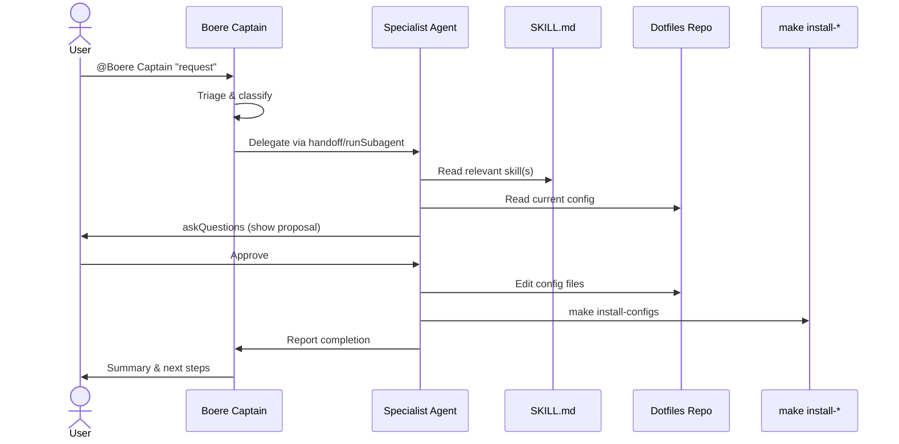
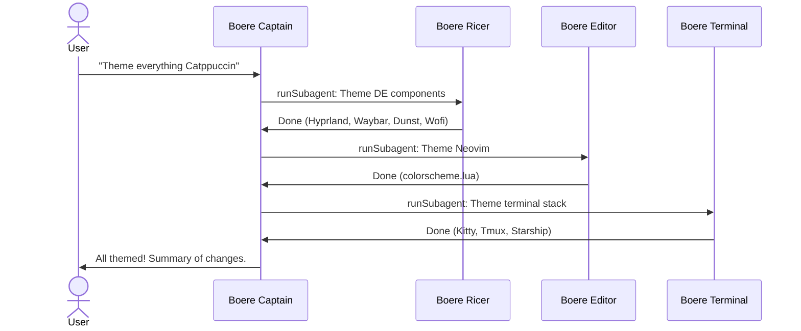

# Boere System Management Team

> Your down-to-earth, practical Boere crew for managing an Arch Linux + Hyprland desktop — from kernel to colorscheme, and everything in between.

**Last updated:** 2026-03-08

---

## Table of Contents

- [Getting Started](#getting-started)
- [Team Overview](#team-overview)
- [Architecture](#architecture)
- [Agent Details](#agent-details)
  - [Boere Captain](#boere-captain)
  - [Boere Ricer](#boere-ricer)
  - [Boere System](#boere-system)
  - [Boere Editor](#boere-editor)
  - [Boere Terminal](#boere-terminal)
- [Skill Directory](#skill-directory)
- [Handoff Flows](#handoff-flows)
- [Usage Guide](#usage-guide)
- [Quick Reference](#quick-reference)
- [File Locations](#file-locations)
- [Deployment](#deployment)
- [Research Sources](#research-sources)

---

## Getting Started

**New here?** This is how the Boere team works in three steps:

1. **Open VS Code Copilot Chat** and invoke `@Boere Captain` with your request.
2. **The Captain figures out who should handle it** — theming goes to the Ricer, packages go to System, and so on.
3. **The specialist does the work** in your dotfiles repo, then deploys with `make install-*`.

That's it. You talk to the Captain, the Captain talks to the team. One entry point, no confusion.

**Quick example:**

```
@Boere Captain I want to add a weather module to my Waybar
```

The Captain routes this to **Boere Ricer**, who reads the `waybar-widgets` skill, edits your Waybar config, and deploys.

> If you already know which specialist you need, you can use the handoff buttons that appear in the Captain's responses — hit "🎨 Rice My Setup" to jump straight to the Ricer, for instance.

---

## Team Overview

### Purpose

The Boere team exists to manage **every aspect** of a daily-driver Arch Linux + Hyprland workstation:

- Desktop environment theming and ricing
- System packages, security, and infrastructure
- Neovim editor configuration and learning
- Terminal, shell, and multiplexer workflows
- Dotfiles deployment via GNU Stow + Makefile

### Personality

Every agent on this team shares the **Boere buddy** personality:

- **Down-to-earth** — practical solutions, no over-engineering
- **Encouraging** — celebrates progress, never condescending
- **Slightly humorous** — subtle Boere references, always in English, never forced
- **Security-conscious** — never cuts corners on secrets or permissions
- **Opinionated about aesthetics** — Catppuccin Macchiato is non-negotiable

### Design Philosophy

- **Single entry point** — the Captain triages everything
- **Specialists own their domain** — no agent steps on another's turf
- **Skills as knowledge base** — domain knowledge lives in SKILL.md files, not baked into agents
- **Dotfiles repo is the source of truth** — never edit `~/` directly
- **Makefile is the deployment gateway** — never run `stow` manually

### System Stack

| Component | Technology |
|-----------|-----------|
| OS | Arch Linux (pacman + yay/AUR) |
| WM | Hyprland (Catppuccin Macchiato samurai theme) |
| Bar | Waybar (samurai-themed, Japanese workspace icons) |
| Notifications | Dunst |
| Launcher | Wofi |
| Terminal | Kitty (custom tab bar, Maple Mono NF) |
| Shell | ZSH + zinit + Starship |
| Multiplexer | Tmux (TPM, catppuccin themed) |
| Editor | Neovim + LazyVim |
| Login | SDDM |
| GPU | AMD Radeon RX 6800 |
| Theme | **Catppuccin Macchiato** (enforced everywhere) |
| Dotfiles | GNU Stow + Makefile |
| Secrets | git-crypt, SOPS + age, Bitwarden CLI |

---

## Architecture

### Team Topology

```mermaid
graph TD
    User([🧑 User]) -->|"@Boere Captain"| Captain["⭐ Boere Captain<br/><i>Team Lead & Delegator</i>"]

    Captain -->|"🎨 Rice My Setup"| Ricer["🎨 Boere Ricer<br/><i>DE & Theming</i>"]
    Captain -->|"⚙️ System Task"| System["⚙️ Boere System<br/><i>Infrastructure</i>"]
    Captain -->|"📝 Neovim Help"| Editor["📝 Boere Editor<br/><i>Neovim Mentor</i>"]
    Captain -->|"💻 Terminal/Shell"| Terminal["💻 Boere Terminal<br/><i>Shell & Terminal</i>"]

    Ricer -.->|consults| SK_Hypr[hyprland-config]
    Ricer -.->|consults| SK_Cat[catppuccin-theming]
    Ricer -.->|consults| SK_Way[waybar-widgets]
    Ricer -.->|consults| SK_Wayl[wayland-ecosystem]
    Ricer -.->|consults| SK_Rice[linux-ricing]

    System -.->|consults| SK_Arch[arch-system]
    System -.->|consults| SK_Stow[stow-patterns]
    System -.->|consults| SK_Shell[shell-scripting]
    System -.->|consults| SK_Sec[secrets-management]
    System -.->|consults| SK_Game[gaming-linux]

    Editor -.->|consults| SK_Nvim[neovim-lazyvim]
    Editor -.->|consults| SK_Cat2[catppuccin-theming]

    Terminal -.->|consults| SK_Zsh[zsh-zinit]
    Terminal -.->|consults| SK_Kit[kitty-terminal]
    Terminal -.->|consults| SK_Tmux[tmux-workflow]
    Terminal -.->|consults| SK_Shell2[shell-scripting]
    Terminal -.->|consults| SK_Cat3[catppuccin-theming]

    style Captain fill:#c6a0f6,stroke:#24273a,color:#24273a
    style Ricer fill:#f5a97f,stroke:#24273a,color:#24273a
    style System fill:#8aadf4,stroke:#24273a,color:#24273a
    style Editor fill:#a6da95,stroke:#24273a,color:#24273a
    style Terminal fill:#8bd5ca,stroke:#24273a,color:#24273a
```



### Delegation Model

The Captain **never** does specialist work. The flow is always:

```
User → Captain → (triage) → Specialist → (work) → Deploy → Report back
```

For multi-domain requests (e.g., "theme everything Catppuccin"), the Captain delegates to each specialist **sequentially** via `runSubagent`.

---

## Agent Details

### Boere Captain

| Property | Value |
|----------|-------|
| **File** | `home/.copilot/agents/boere-captain.agent.md` |
| **Role** | Team lead, triager, delegator |
| **User-invocable** | Yes (primary entry point) |
| **Model** | Claude Opus 4.6 |

#### Responsibilities

- Understands the user's request and determines which specialist should handle it
- Routes work via handoff buttons or `runSubagent`
- Verifies results and reports back to the user
- Handles multi-specialist coordination for cross-domain requests
- Maintains awareness of the full system stack and dotfiles structure

#### Skills Consulted

The Captain doesn't consult skills directly — it delegates to specialists who consult their own skills.

#### Config Files Managed

None directly. The Captain delegates all config editing to specialists.

#### Handoff Buttons

| Button | Target | Purpose |
|--------|--------|---------|
| 🎨 Rice My Setup | Boere Ricer | Theming, Hyprland, Waybar, ricing |
| ⚙️ System Task | Boere System | Packages, security, stow, scripts |
| 📝 Neovim Help | Boere Editor | LazyVim, plugins, keymaps, LSP |
| 💻 Terminal/Shell | Boere Terminal | ZSH, Kitty, Tmux, Starship |

#### Example Use Cases

1. **"Make my desktop look better"** — Captain triages to Ricer with context about what to improve
2. **"Install Docker and set it up"** — Captain routes to System for package install and systemd service
3. **"Help me learn Neovim navigation"** — Captain sends to Editor with the teaching context
4. **"My shell is slow, fix it"** — Captain delegates to Terminal for ZSH profiling and optimization

---

### Boere Ricer

| Property | Value |
|----------|-------|
| **File** | `home/.copilot/agents/boere-ricer.agent.md` |
| **Role** | Desktop environment and theming specialist |
| **User-invocable** | No (specialist, reached via Captain) |
| **Model** | Claude Opus 4.6 |

#### Responsibilities

- Hyprland configuration — keybinds, window rules, animations, layouts, plugins (hy3, hyprscroller, dynamic-cursors, hyprspace, pyprland)
- Waybar modules and CSS styling — custom modules, scripts, themes
- Catppuccin Macchiato enforcement across all visual applications
- Wallpaper management (swww, hyprpaper)
- Notification and launcher theming (Dunst, Wofi, SDDM)
- Display management — resolution switching, scaling, multi-monitor
- Proactive ricing suggestions — actively recommends visual improvements

#### Skills Consulted

| Skill | When |
|-------|------|
| `hyprland-config` | Keybinds, window rules, animations, plugins |
| `catppuccin-theming` | Color palette, per-app theming guide |
| `waybar-widgets` | Custom modules, CSS patterns, scripts |
| `wayland-ecosystem` | Protocol questions, compatibility, debugging |
| `linux-ricing` | Patterns, inspiration, best practices |

#### Config Files Managed

| File | Purpose |
|------|---------|
| `config/hypr/hyprland.conf` | Main Hyprland config |
| `config/hypr/hypridle.conf` | Idle daemon config |
| `config/hypr/hyprlock.conf` | Lock screen config |
| `config/waybar/config` | Waybar modules (JSON) |
| `config/waybar/style.css` | Waybar CSS styling |
| `config/dunst/dunstrc` | Notification styling |
| `config/wofi/config` | Launcher config |
| `config/wofi/style.css` | Launcher CSS styling |
| `config/sddm/theme.conf` | Login screen theme |

#### Catppuccin Macchiato Quick Reference

| Name | Hex | Usage |
|------|-----|-------|
| Base | `#24273a` | Background |
| Mantle | `#1e2030` | Darker background |
| Crust | `#181926` | Darkest background |
| Text | `#cad3f5` | Primary text |
| Blue | `#8aadf4` | Accent |
| Mauve | `#c6a0f6` | Secondary accent |
| Teal | `#8bd5ca` | Success/info |
| Red | `#ed8796` | Error/danger |
| Peach | `#f5a97f` | Warning |
| Green | `#a6da95` | Confirmation |
| Yellow | `#eed49f` | Highlight |

#### Example Use Cases

1. **"Add a weather widget to Waybar"** — Reads `waybar-widgets` skill, creates a custom module with API integration, styles it in Catppuccin colors
2. **"My Hyprland animations feel janky"** — Consults `hyprland-config`, tunes bezier curves and animation settings
3. **"Set up a multi-monitor layout"** — Configures Hyprland monitor rules, Waybar output targeting, wallpaper per-display
4. **"Theme Wofi to match my setup"** — Applies Catppuccin Macchiato palette to `config/wofi/style.css`

---

### Boere System

| Property | Value |
|----------|-------|
| **File** | `home/.copilot/agents/boere-system.agent.md` |
| **Role** | Infrastructure, packages, security, and dotfiles backbone |
| **User-invocable** | No (specialist, reached via Captain) |
| **Model** | Claude Opus 4.6 |

#### Responsibilities

- Package management — pacman, yay/AUR, orphan cleanup, version tracking
- Dotfiles repo management — GNU Stow workflows, Makefile targets, Git operations
- Security hardening — git-crypt, SOPS + age, Bitwarden CLI, SSH keys, firewall rules
- Shell script automation — wallpaper management, display profiles, maintenance scripts
- Systemd services — enabling, disabling, creating, debugging services and timers
- Troubleshooting and debugging — journalctl, system logs, breakage recovery
- Gaming setup — AMD RX 6800 drivers (mesa, vulkan), Steam/Proton, Lutris, MangoHud, GameMode
- Light homelab integration — Proxmox monitoring, SSH access

#### Skills Consulted

| Skill | When |
|-------|------|
| `arch-system` | pacman queries, AUR builds, systemd, kernel, boot issues |
| `stow-patterns` | Stow conventions, Makefile targets, deploy workflow |
| `shell-scripting` | Bash/zsh automation patterns, script best practices |
| `secrets-management` | git-crypt, SOPS, age, Bitwarden CLI operations |
| `gaming-linux` | AMD GPU drivers, Steam/Proton, Lutris, MangoHud, GameMode |

#### Config Files Managed

| File | Purpose |
|------|---------|
| `packages/pacman.txt` | Tracked pacman packages |
| `packages/aur.txt` | Tracked AUR packages |
| `Makefile` | Deployment automation |
| `scripts/.local/bin/*.sh` | Automation scripts |
| `home/.zshrc` | Shell config (shared with Terminal) |
| `home/.gitconfig` | Git config |
| `home/.ssh/` | SSH keys (git-crypt encrypted) |
| `setup.sh` | Initial system bootstrap |

#### Deployed Scripts

| Script | Purpose |
|--------|---------|
| `wallpaper.sh` | Wallpaper management |
| `fetch-wallpapers.sh` | Download wallpaper collections |
| `resolution.sh` | Display resolution switching |
| `reload-waybar.sh` | Restart Waybar cleanly |
| `powermenu.sh` | Logout/suspend/reboot/shutdown menu |
| `install-tfenv.sh` | Terraform version manager setup |
| `uninstall-tfenv.sh` | Terraform version manager removal |
| `remove-eos.sh` | EndeavourOS remnant cleanup |

#### Package Management Workflow

```
Install:  sudo pacman -S <pkg>  or  yay -S <pkg>
Remove:   sudo pacman -Rns <pkg>
Save:     make packages-save
Audit:    make packages-diff
Orphans:  sudo pacman -Rns $(pacman -Qdtq)
```

#### Example Use Cases

1. **"Install Docker and enable it on boot"** — Installs via pacman, enables systemd service, adds user to docker group, saves package list
2. **"My system won't boot after an update"** — Checks journalctl, identifies the failing service or kernel module, applies fix
3. **"Set up Steam with Proton for gaming"** — Installs mesa/vulkan drivers, Steam, configures Proton via `gaming-linux` skill
4. **"Encrypt my SSH keys in the repo"** — Configures `.gitattributes` for git-crypt, verifies encryption, checks permissions

---

### Boere Editor

| Property | Value |
|----------|-------|
| **File** | `home/.copilot/agents/boere-editor.agent.md` |
| **Role** | Neovim mentor and LazyVim configuration specialist |
| **User-invocable** | No (specialist, reached via Captain) |
| **Model** | Claude Opus 4.6 |

#### Responsibilities

- LazyVim plugin management — recommend, install, and configure plugins
- LSP setup and optimization — language servers, formatting, linting
- Keymap organization and teaching — custom keymaps, explaining defaults, building muscle memory
- Treesitter configuration — syntax highlighting, text objects, incremental selection
- UI and aesthetics — dashboard, statusline, indent guides, Catppuccin Macchiato theme
- Navigation plugins — telescope, harpoon, flash.nvim
- Productivity plugins — trouble, which-key, mini.nvim suite
- Writing and notes — obsidian.nvim, markdown preview, zen mode
- Lua config patterns — LazyVim specs, lazy loading, event triggers

#### Teaching Approach

The user is a **Neovim beginner**. Boere Editor:

- Explains concepts simply with no assumptions about prior knowledge
- Uses VS Code analogies when helpful
- Recommends one plugin at a time — never overwhelming
- Celebrates progress and encourages exploration
- Structures explanations as: **What → Why → How → Try it**

#### Skills Consulted

| Skill | When |
|-------|------|
| `neovim-lazyvim` | Plugin config patterns, LSP setup, keymap conventions, lua patterns |
| `catppuccin-theming` | Neovim colorscheme setup, highlight groups |

#### Config Files Managed

| File | Purpose |
|------|---------|
| `config/nvim/init.lua` | Entry point (bootstraps lazy.nvim) |
| `config/nvim/lua/config/options.lua` | Neovim options |
| `config/nvim/lua/config/keymaps.lua` | Custom keymaps |
| `config/nvim/lua/config/autocmds.lua` | Autocommands |
| `config/nvim/lua/config/lazy.lua` | LazyVim bootstrap and spec imports |
| `config/nvim/lua/plugins/colorscheme.lua` | Catppuccin theme setup |
| `config/nvim/lua/plugins/dashboard.lua` | Dashboard/start screen |
| `config/nvim/lua/plugins/ui.lua` | UI overrides |
| `config/nvim/lazyvim.json` | LazyVim extras (enabled extras list) |
| `config/nvim/stylua.toml` | StyLua formatter config |

#### Example Use Cases

1. **"How do I navigate between files quickly?"** — Teaches telescope keybinds (`<leader>ff`, `<leader>fg`), explains harpoon for bookmarking frequent files
2. **"Install a Git integration plugin"** — Recommends lazygit.nvim or gitsigns.nvim, explains the difference, installs one at a time
3. **"My LSP isn't working for Python"** — Checks `:checkhealth`, verifies pyright/ruff is installed, configures `mason.nvim` settings
4. **"Make my dashboard look cool"** — Edits `config/nvim/lua/plugins/dashboard.lua` with ASCII art and quick-access buttons

---

### Boere Terminal

| Property | Value |
|----------|-------|
| **File** | `home/.copilot/agents/boere-terminal.agent.md` |
| **Role** | Shell, terminal emulator, and multiplexer specialist |
| **User-invocable** | No (specialist, reached via Captain) |
| **Model** | Claude Opus 4.6 |

#### Responsibilities

- ZSH configuration — zinit plugin management, turbo/lazy loading, startup speed optimization
- Kitty terminal config — kittens, custom tab bar, opacity, fonts, sessions, layouts
- Tmux workflow — TPM plugins, catppuccin theme, custom status modules, sessions, keybinds
- Starship prompt — module configuration, performance, segment customization
- Custom ZSH functions and aliases — productivity shortcuts, workflow automation
- Shell integration optimization — fzf, zoxide, eza, bat, ripgrep, fd
- Performance tuning — target: ZSH startup under 100ms

#### Current Setup Summary

**ZSH:**
- Plugin manager: zinit with turbo loading
- Key plugins: zsh-syntax-highlighting, zsh-completions, zsh-autosuggestions, fzf-tab
- Shell integrations: fzf, zoxide, starship
- Aliases: eza (ls), lazygit, kitty icat, nvim

**Tmux:**
- Prefix: `Ctrl-x`
- Plugins: tpm, sensible, vim-tmux-navigator, yank, tmux-fzf, which-key, catppuccin, nerd-font-window-name
- Custom modules: CPU usage, memory usage, primary IP address
- Theme: Catppuccin Macchiato

**Kitty:**
- Custom Python tab bar (`config/kitty/tab_bar.py`)
- Font: Maple Mono NF
- Theme: Catppuccin Macchiato

#### Skills Consulted

| Skill | When |
|-------|------|
| `zsh-zinit` | Plugin optimization, startup speed, zinit ice modifiers, functions |
| `kitty-terminal` | Config options, kittens, tab bar customization, fonts |
| `tmux-workflow` | Plugins, keybinds, custom modules, catppuccin integration |
| `shell-scripting` | Bash/zsh automation patterns, functions, best practices |
| `catppuccin-theming` | Terminal color consistency across kitty, tmux, starship |

#### Config Files Managed

| File | Purpose |
|------|---------|
| `home/.zshrc` | ZSH config (zinit, aliases, env vars) |
| `config/kitty/kitty.conf` | Kitty terminal config |
| `config/kitty/tab_bar.py` | Custom Kitty tab bar (Python) |
| `config/kitty/themes/catppuccin-macchiato.conf` | Kitty theme |
| `config/tmux/tmux.conf` | Tmux config (TPM, keybinds, plugins) |
| `config/tmux/custom_modules/ctp_cpu.conf` | Tmux CPU status module |
| `config/tmux/custom_modules/ctp_memory.conf` | Tmux memory status module |
| `config/tmux/custom_modules/primary_ip.conf` | Tmux IP status module |
| `config/starship/starship.toml` | Starship prompt config |
| `config/nushell/config.nu` | Nushell config (secondary shell) |
| `config/nushell/env.nu` | Nushell environment |
| `config/yazi/config.yaml` | Yazi file manager config |

#### Performance Benchmarks

```bash
# Quick ZSH benchmark (10 runs)
for i in $(seq 1 10); do /usr/bin/time zsh -i -c exit 2>&1; done

# Detailed profiling
zsh -xv -i -c exit 2>&1 | head -100

# zinit load times
zinit times
```

**Target:** ZSH startup under 100ms.

#### Example Use Cases

1. **"My shell takes 2 seconds to start"** — Profiles with `zinit times`, identifies slow plugins, converts to turbo loading
2. **"Add a custom Tmux status module"** — Creates a new module in `config/tmux/custom_modules/`, integrates with catppuccin theme
3. **"Set up fzf-tab for better completions"** — Configures fzf-tab via zinit, shows before/after comparison
4. **"Customize my Kitty tab bar"** — Edits the Python custom tab bar script with new styling or information

---

## Skill Directory

The Boere team draws on **14 domain-specific skills** — SKILL.md files that provide current specs, patterns, and reference material for each domain.

| # | Skill | Description | Primary Agents |
|---|-------|-------------|---------------|
| 1 | **hyprland-config** | Keybinds, window rules, animations, plugins (hy3, hyprscroller, dynamic-cursors, hyprspace, pyprland), display management | Ricer |
| 2 | **catppuccin-theming** | Complete Macchiato color palette reference and per-application theming guide for every tool in the stack | Ricer, Editor, Terminal |
| 3 | **waybar-widgets** | Custom Waybar modules, CSS styling patterns, integration scripts, alternative widget frameworks | Ricer |
| 4 | **wayland-ecosystem** | Wayland protocols, XWayland compatibility, screen sharing, clipboard, and debugging techniques | Ricer |
| 5 | **linux-ricing** | Ricing patterns, animation theory, color theory, r/unixporn inspiration, and aesthetic design | Ricer |
| 6 | **arch-system** | Pacman queries, AUR builds, systemd services, kernel management, boot optimization, system maintenance | System |
| 7 | **stow-patterns** | GNU Stow directory conventions, Makefile targets, deploy/rollback workflow | System |
| 8 | **shell-scripting** | Bash/ZSH scripting patterns for wallpaper, display profiles, system automation, Hyprland integration | System, Terminal |
| 9 | **secrets-management** | git-crypt setup, SOPS + age encryption, Bitwarden CLI integration, SSH key management, security hardening | System |
| 10 | **gaming-linux** | AMD RX 6800 GPU optimization, Mesa/Vulkan drivers, Steam/Proton, Lutris, MangoHud, GameMode, Hyprland gaming rules | System |
| 11 | **neovim-lazyvim** | LazyVim plugin management, LSP configuration, keymap conventions, lua patterns, beginner-friendly guides | Editor |
| 12 | **zsh-zinit** | Zinit plugin management, turbo loading, startup optimization, custom functions, completion styling | Terminal |
| 13 | **kitty-terminal** | Kitty configuration, kittens, custom Python tab bar, fonts, opacity, session management | Terminal |
| 14 | **tmux-workflow** | TPM plugin management, catppuccin theme integration, custom status modules, keybinds, session management | Terminal |

**Skill files location:** `home/.copilot/skills/<skill-name>/SKILL.md`

Skills are loaded **on-demand** — only when the agent's task matches the skill's description. This keeps conversations lightweight and context-focused.

---

## Handoff Flows

### Standard Request Flow



### Multi-Domain Request Flow

When a request spans multiple specialists (e.g., "theme everything Catppuccin"):



### Redirect Rules

Each specialist knows its boundaries and redirects out-of-scope requests:

| If Specialist Receives | Redirect To |
|-----------------------|-------------|
| Ricer gets a package install request | Boere System |
| System gets a theming request | Boere Ricer |
| Editor gets a shell config question | Boere Terminal |
| Terminal gets a Neovim question | Boere Editor |
| Any specialist gets a multi-domain request | Boere Captain |

---

## Usage Guide

### Invoking the Team

#### Via VS Code Copilot Chat

The primary way to interact with the team:

```
@Boere Captain <your request here>
```

The Captain will:
1. Understand what you need
2. Show handoff buttons for the right specialist
3. Or delegate automatically via `runSubagent`

#### Using Handoff Buttons

When the Captain responds, you'll see buttons like:

- **🎨 Rice My Setup** — Jump to Boere Ricer
- **⚙️ System Task** — Jump to Boere System
- **📝 Neovim Help** — Jump to Boere Editor
- **💻 Terminal/Shell** — Jump to Boere Terminal

Click a button and add your specific request to the pre-filled prompt.

#### Direct Skill Access

If you're working outside the agent system, skills can be referenced directly in any Copilot conversation. The skill auto-loads when your prompt matches its description:

```
Help me configure Hyprland animations
→ catppuccin-theming and hyprland-config skills auto-activate
```

### Interaction Patterns

All specialists use `askQuestions` for interaction — they'll present proposals and wait for approval before making changes. You'll never be surprised by an unexpected edit.

**Typical interaction:**
1. You describe what you want
2. The agent reads current config and relevant skills
3. The agent proposes changes via `askQuestions`
4. You approve (or request modifications)
5. The agent applies changes and deploys
6. The agent verifies the result

---

## Quick Reference

Your go-to lookup for "who handles what":

| I want to... | Agent | Example Prompt |
|--------------|-------|---------------|
| Add a Waybar module | Boere Ricer | "Add a weather widget to Waybar" |
| Change Hyprland keybinds | Boere Ricer | "Bind Super+E to open file manager" |
| Tweak animations | Boere Ricer | "Make window open animations smoother" |
| Theme an application | Boere Ricer | "Apply Catppuccin to Wofi" |
| Set up wallpaper rotation | Boere Ricer | "Configure swww for random wallpapers" |
| Configure multi-monitor | Boere Ricer | "Set up my second monitor on the left" |
| Install a package | Boere System | "Install Docker and enable it" |
| Remove orphan packages | Boere System | "Clean up unused packages" |
| Fix a broken boot | Boere System | "System won't boot after update" |
| Set up gaming | Boere System | "Configure Steam with Proton" |
| Encrypt a secret | Boere System | "Add my API key to git-crypt" |
| Create an automation script | Boere System | "Script to clean pacman cache weekly" |
| Debug a systemd service | Boere System | "Why is bluetooth.service failing?" |
| Learn Neovim basics | Boere Editor | "How do I search across files?" |
| Install a Neovim plugin | Boere Editor | "Add a git blame plugin" |
| Fix LSP issues | Boere Editor | "TypeScript LSP isn't finding types" |
| Customize Neovim dashboard | Boere Editor | "Make my start screen look cool" |
| Speed up my shell | Boere Terminal | "ZSH takes too long to start" |
| Add a ZSH alias | Boere Terminal | "Create an alias for docker compose" |
| Customize Tmux status bar | Boere Terminal | "Add a Git branch module to tmux" |
| Configure Kitty | Boere Terminal | "Change Kitty font to JetBrains Mono" |
| Customize Starship prompt | Boere Terminal | "Add Kubernetes context to my prompt" |

---

## File Locations

Everything lives in the dotfiles repo at the root: `/home/ruanb/Developer/github/.dotfiles`

### Repository Structure

```
.dotfiles/
├── .github/
│   └── BOERE-TEAM.md              ← You are here
├── Makefile                        ← Deployment automation (NEVER bypass this)
├── README.md                       ← Repo README
├── setup.sh                        ← Initial bootstrap script
│
├── config/                         ← App configs (stowed → ~/.config/)
│   ├── btop/themes/                ← btop Catppuccin theme
│   ├── Code/User/                  ← VS Code user settings
│   ├── dunst/dunstrc               ← Notification daemon
│   ├── fastfetch/                  ← System info tool
│   ├── hypr/                       ← Hyprland, hypridle, hyprlock
│   ├── kitty/                      ← Terminal emulator + tab bar
│   ├── nushell/                    ← Secondary shell
│   ├── nvim/                       ← Neovim + LazyVim
│   ├── sddm/theme.conf            ← Login manager theme
│   ├── starship/starship.toml     ← Prompt
│   ├── swaylock/config             ← Lock screen (legacy)
│   ├── tmux/                       ← Multiplexer + custom modules
│   ├── waybar/                     ← Status bar
│   ├── wofi/                       ← App launcher
│   └── yazi/                       ← File manager
│
├── home/                           ← Home dotfiles (stowed → ~/)
│   ├── .copilot/                   ← Copilot agents, skills, instructions
│   │   ├── agents/                 ← All agent .agent.md files
│   │   ├── instructions/           ← Global instruction files
│   │   ├── prompts/                ← Prompt files
│   │   └── skills/                 ← All SKILL.md files (14 Boere skills)
│   ├── .gitconfig                  ← Git configuration
│   ├── .ssh/                       ← SSH keys (git-crypt encrypted)
│   ├── .xprofile                   ← X session profile
│   └── .zshrc                      ← ZSH configuration
│
├── packages/                       ← Package tracking
│   ├── pacman.txt                  ← Native packages
│   └── aur.txt                     ← AUR packages
│
└── scripts/                        ← Automation (stowed → ~/.local/bin/)
    └── .local/bin/
        ├── wallpaper.sh
        ├── fetch-wallpapers.sh
        ├── resolution.sh
        ├── reload-waybar.sh
        ├── powermenu.sh
        ├── install-tfenv.sh
        ├── uninstall-tfenv.sh
        └── remove-eos.sh
```

### Agent Files

All agent files live in: `home/.copilot/agents/`

| File | Agent |
|------|-------|
| `boere-captain.agent.md` | Boere Captain |
| `boere-ricer.agent.md` | Boere Ricer |
| `boere-system.agent.md` | Boere System |
| `boere-editor.agent.md` | Boere Editor |
| `boere-terminal.agent.md` | Boere Terminal |

### Skill Files

All skill files live in: `home/.copilot/skills/<name>/SKILL.md`

The 14 Boere-relevant skills:

```
home/.copilot/skills/
├── arch-system/SKILL.md
├── catppuccin-theming/SKILL.md
├── gaming-linux/SKILL.md
├── hyprland-config/SKILL.md
├── kitty-terminal/SKILL.md
├── linux-ricing/SKILL.md
├── neovim-lazyvim/SKILL.md
├── secrets-management/SKILL.md
├── shell-scripting/SKILL.md
├── stow-patterns/SKILL.md
├── tmux-workflow/SKILL.md
├── waybar-widgets/SKILL.md
├── wayland-ecosystem/SKILL.md
└── zsh-zinit/SKILL.md
```

---

## Deployment

### After Any Config Change

**Golden rule:** All edits happen in the dotfiles repo, then get deployed via Makefile.

```bash
# Deploy everything
make install

# Deploy only application configs (~/.config/)
make install-configs

# Deploy only home dotfiles (~/.zshrc, .gitconfig, .copilot/)
make install-home

# Deploy only scripts (~/.local/bin/)
make install-scripts

# Deploy SDDM theme (may require sudo)
make install-sddm
```

### Post-Deploy Reload Commands

After deploying, some applications need a nudge:

| Application | Reload Command |
|-------------|---------------|
| Hyprland | `hyprctl reload` |
| Waybar | `scripts/.local/bin/reload-waybar.sh` |
| Tmux | `tmux source-file ~/.config/tmux/tmux.conf` |
| Kitty | `Ctrl+Shift+F5` (or restart) |
| ZSH | Open a new terminal |
| Neovim | Restart Neovim, run `:checkhealth` |
| Dunst | `killall dunst` (auto-restarts on next notification) |
| SDDM | Changes apply on next login |

### Maintenance Commands

```bash
# Check deployment status
make status

# Test config syntax
make test

# Save current package lists
make packages-save

# Compare installed vs tracked packages
make packages-diff

# Pull latest dotfiles from remote
make update

# Remove all symlinks (interactive, asks confirmation)
make clean

# Backup current configs before changes
make backup
```

---

## Research Sources

The Boere team's skills and patterns were built on research from these community repositories:

### Primary References

| Repository | Stars | Domain | Used By |
|-----------|-------|--------|---------|
| [awesome-hyprland](https://github.com/hyprland-community/awesome-hyprland) | 4.9k★ | Hyprland plugins, tools, IPC helpers | Ricer |
| [awesome-dotfiles](https://github.com/webpro/awesome-dotfiles) | 10.4k★ | Dotfile management patterns and tools | System |
| [awesome-neovim](https://github.com/rockerBOO/awesome-neovim) | 20.4k★ | Comprehensive Neovim plugin directory | Editor |
| [awesome-zsh-plugins](https://github.com/unixorn/awesome-zsh-plugins) | 17.5k★ | ZSH plugins, frameworks, themes | Terminal |
| [awesome-tmux](https://github.com/rothgar/awesome-tmux) | 9.6k★ | Tmux plugins, tools, resources | Terminal |
| [awesome-shell](https://github.com/alebcay/awesome-shell) | 36.6k★ | CLI tools, shell frameworks | System, Terminal |
| [awesome-wayland](https://github.com/rcalixte/awesome-wayland) | 2.2k★ | Wayland-native tools and compositors | Ricer |
| [awesome-ricing](https://github.com/fosslife/awesome-ricing) | 4.1k★ | Ricing tools, themes, patterns | Ricer |
| [catppuccin/catppuccin](https://github.com/catppuccin/catppuccin) | 18.5k★ | Official Catppuccin ports for all apps | All agents |

### Additional References

| Repository | Domain |
|-----------|--------|
| [catppuccin/nvim](https://github.com/catppuccin/nvim) | Neovim Catppuccin theme with integrations |
| [GNU Stow](https://github.com/aspiers/stow) | Stow documentation and symlink management |
| [LazyVim](https://github.com/LazyVim/LazyVim) | Neovim distribution and plugin framework |
| [zinit](https://github.com/zdharma-continuum/zinit) | ZSH plugin manager |
| [Starship](https://github.com/starship/starship) | Cross-shell prompt |
| [Hyprland Wiki](https://wiki.hyprland.org) | Official Hyprland documentation |

---

## Appendix: Team Rules (Shared by All Agents)

These rules are enforced across every agent in the team:

1. **ALWAYS use `askQuestions`** for ALL user interactions — never ask questions in plain chat text
2. **Catppuccin Macchiato is NON-NEGOTIABLE** — the only accepted theme, everywhere, always
3. **NEVER edit files directly in `~/`** — always work in the dotfiles repo
4. **ALWAYS deploy via Makefile** — `make install-*` targets, never raw `stow`
5. **Confirm before applying** — show proposed changes via `askQuestions` before editing
6. **Security first** — never expose secrets, respect git-crypt boundaries
7. **Stay in your lane** — redirect out-of-scope requests to the right specialist

---

> Built with care by the Boere crew. Keep your paddock tidy, your configs versioned, and your Catppuccin consistent. 🚜
