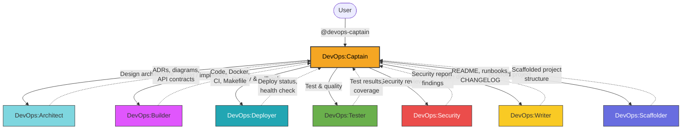
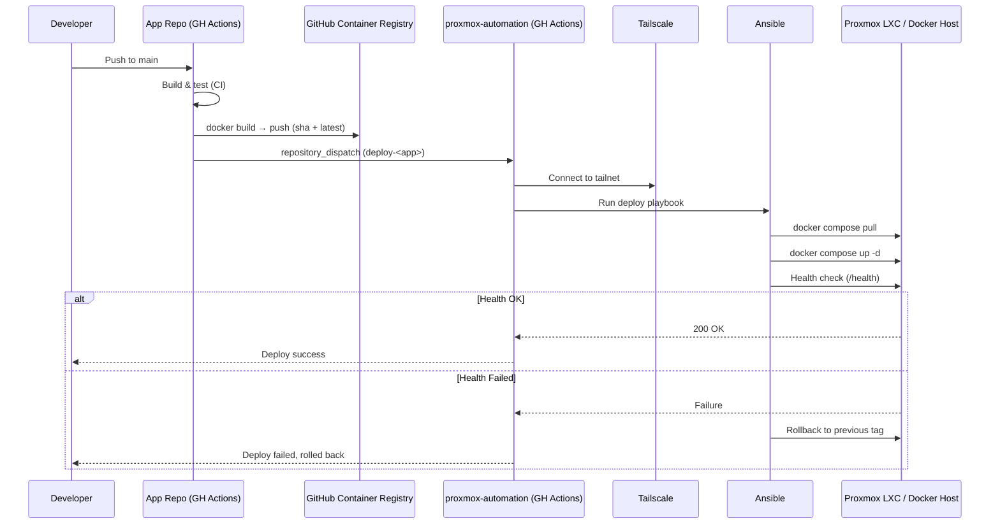
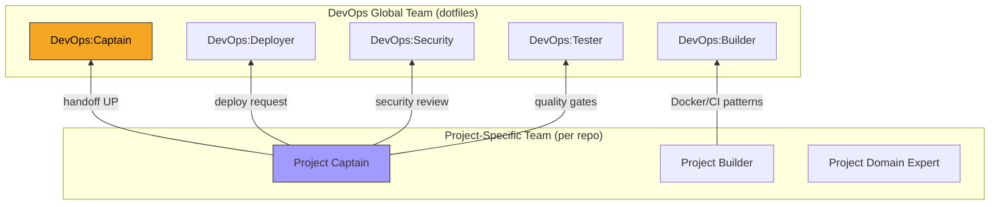

# DevOps Agent Team

> Global app-side DevOps team — from project scaffolding to production deployment.

**Last updated:** 2025-07-14

---

## 1. Team Overview

**DevOps** is a global Copilot agent team that owns the **application development lifecycle** — project bootstrapping, coding, testing, security, deployment, and documentation. It lives in the user's dotfiles and is available across all workspaces.

### Naming Convention

All agents use the `Team:Role` naming convention:

| Agent | Role |
|-------|------|
| **DevOps:Captain** | Team captain — orchestrates, delegates, verifies |
| **DevOps:Architect** | Service topology, API contracts, tech stack |
| **DevOps:Builder** | Code, Dockerfiles, CI pipelines, Makefiles |
| **DevOps:Deployer** | GH Actions deploys, health checks, rollback |
| **DevOps:Tester** | Tests, quality gates, coverage |
| **DevOps:Security** | Dependency audits, OWASP, secrets management |
| **DevOps:Writer** | README, API docs, runbooks, ADRs |
| **DevOps:Scaffolder** | Project bootstrapping with templates |

### Scope

- **Owns:** App code, Dockerfiles, CI/CD pipelines, Makefiles, testing, security reviews, app documentation, deployment workflows
- **Does NOT own:** Proxmox cluster infrastructure, personal workstation config (Dotfiles team), agent creation (Genesis team)

---

## 2. Team Roster

| Agent | Role | Description | User-Invocable |
|-------|------|-------------|:--------------:|
| **DevOps:Captain** | Captain | Orchestrates the full app dev lifecycle — triages, delegates, verifies | Yes |
| **DevOps:Architect** | Architect | Designs service topology, API contracts, tech stack decisions | No |
| **DevOps:Builder** | Builder | Writes code, Dockerfiles, CI pipelines, Makefiles | No |
| **DevOps:Deployer** | Deployer | Manages GH Actions deploys, health checks, rollback, Ansible playbooks | No |
| **DevOps:Tester** | Tester | Writes tests, quality gates, coverage enforcement, linting config | No |
| **DevOps:Security** | Security | Dependency audits, secrets management review, OWASP compliance | No |
| **DevOps:Writer** | Writer | README, API docs, runbooks, ADRs, CHANGELOG | No |
| **DevOps:Scaffolder** | Scaffolder | Scaffolds new projects with Docker, CI, Makefile templates | No |

**Entry point:** All interactions go through `@devops-captain`. Specialists are invoked internally via `runSubagent`.

---

## 3. Architecture Diagram



---

## 4. Delegation Flow

Captain is an **orchestrator, not an implementer**. Never creates or edits code files directly.

### Routing Logic

```
User request arrives at DevOps:Captain
  │
  ├── New project?               → Scaffolder → Builder
  ├── Architecture/design?       → Architect
  ├── Code/Docker/CI changes?    → Builder
  ├── Deploy/rollback?           → Deployer
  ├── Tests/quality/linting?     → Tester
  ├── Security concern?          → Security
  ├── Documentation?             → Writer
  └── Multi-domain request?      → Sequential delegation to each relevant specialist
```

### Checkpoint Protocol

| Phase | Steps | Gate |
|-------|-------|------|
| **CP1: Understand & Design** | Gather requirements → Research existing code → Draft plan | User approval via `askQuestions` |
| **CP2: Implement & Test** | Delegate to specialists → Run tests → Report results | All tests green |
| **CP3: Review** | Security review (Security) → Quality check | No critical/high findings |
| **CP4: Document & Deploy** | Documentation (Writer) → Deploy (Deployer) → Health check | Deployment healthy |

---

## 5. Deployment Pipeline

The DevOps team enforces a standardized cross-repo deployment flow for all applications:



### Pipeline Steps

| Step | Where | What |
|------|-------|------|
| 1. Build & test | App repo CI | Lint, test, build Docker image (multi-stage) |
| 2. Push image | App repo CI | Tag with `sha-<commit>` + `latest`, push to GHCR |
| 3. Dispatch | App repo CI | `repository_dispatch` event to `proxmox-automation` |
| 4. Connect | Infra repo CI | Tailscale GitHub Action establishes cluster connectivity |
| 5. Deploy | Infra repo CI | Ansible playbook: `docker compose pull && up -d` |
| 6. Validate | Infra repo CI | HTTP health check with retries |
| 7. Rollback | Infra repo CI | On failure: revert to previous image tag |

### Deployment Targets

- Proxmox LXC containers running Docker
- Docker directly on Proxmox hosts
- All apps run as `docker-compose` services

---

## 6. Sub-Team Extension Model

Project-specific agent teams (generated via **Genesis:Captain**) extend the DevOps global team using a **hybrid model**:



### How It Works

| Layer | Owns | Examples |
|-------|------|---------|
| **Project team** | Domain-specific logic | Business rules, features, data models, project-specific API routes |
| **DevOps global team** | Cross-cutting DevOps | Docker conventions, CI pipeline templates, deploy flow, security review, quality gates |

### Handoff Direction

- **Project agents → DevOps agents** (hand off UP for shared DevOps patterns)
- **Never DevOps → Project agents** (DevOps doesn't know about project-specific domain logic)

### Generating Project Sub-Teams

1. Open the project repo in VS Code
2. Invoke `@genesis-captain` to analyse the codebase and generate a project-specific team
3. Genesis creates agents in the project's `.github/agents/` directory
4. Project agents reference DevOps agents for DevOps handoffs

---

## 7. Supported Tech Stacks

| Type | Stack | Framework Options | Notes |
|------|-------|-------------------|-------|
| **Web API** | Python | FastAPI, Flask | REST/GraphQL backends, async support |
| **Web API** | Node.js / TypeScript | Express, Fastify, Hono | TypeScript required (no plain JS) |
| **Web App** | Node.js / TypeScript | — | Frontend, BFF, or full-stack |
| **CLI Tool** | Python | Click, Typer | Rich output, argument parsing |
| **CLI Tool** | Node.js / TypeScript | Commander | Subcommands, TypeScript |
| **Background Worker** | Python or Node.js | — | Cron jobs, queue consumers, schedulers |

### Tooling Conventions

| Concern | Python | Node.js / TypeScript |
|---------|--------|----------------------|
| **Package manager** | `pyproject.toml` / Poetry | `package.json` / npm |
| **Linting** | ruff | ESLint |
| **Formatting** | ruff | Prettier |
| **Testing** | pytest + pytest-cov + pytest-asyncio | vitest (preferred) or jest |
| **Type checking** | mypy | tsc (strict mode) |
| **Base Docker image** | `python:3.12-slim` | `node:20-alpine` |

### Infrastructure Constraints

- **Docker-first** — every app gets a `Dockerfile` + `docker-compose.yml`
- **No Kubernetes** — the cluster runs bare Docker on LXC, not K8s
- **Config via env vars** — no baked-in config, everything external
- **Health check endpoints** — every service exposes `/health`

---

## 8. Bootstrapping (DevOps:Scaffolder)

When scaffolding a new project, Scaffolder generates a complete, production-ready project structure.

### Requirements Interview

Scaffolder uses `askQuestions` to gather:

1. Project name and description
2. Language/framework choice
3. Database needs (PostgreSQL, SQLite, Redis, none)
4. Auth requirements (JWT, API key, none)
5. Target deployment (LXC + Docker, Docker on host)
6. Monitoring (Prometheus metrics, health check, both, none)

### Generated Files

| File | Purpose |
|------|---------|
| `Dockerfile` | Multi-stage build, non-root user, HEALTHCHECK, OCI labels |
| `docker-compose.yml` | Dev + production profiles with all service dependencies |
| `.github/workflows/ci.yml` | Build, test, lint on PR; Docker push + dispatch on main merge |
| `Makefile` | Standard targets: build, test, lint, format, run, docker-build, docker-push, clean, help |
| `README.md` | Setup, usage, deployment, and configuration docs |
| `.gitignore` | Language-appropriate ignores |
| `.dockerignore` | Excludes `.git`, `node_modules`, `__pycache__`, `.env`, test artifacts |
| `.editorconfig` | Consistent editor settings |
| Linting config | `ruff.toml` or `.eslintrc` depending on stack |
| Test scaffolding | `tests/` directory with framework config and example test |
| Source structure | `src/` with entry point, config, and routes directory |

### Makefile Standard Targets

```
make build          # Build the application
make test           # Run all tests
make lint           # Run linters
make format         # Auto-format code
make run            # Run locally for development
make docker-build   # Build Docker image
make docker-run     # Run Docker container locally
make docker-push    # Push to GHCR
make clean          # Clean build artifacts
make help           # List all targets (default)
```

---

## 9. Relationship to Other Teams

### Infra Team (proxmox-automation repo)

```
┌─────────────────────────────┐     ┌─────────────────────────────┐
│       DevOps Team           │     │       Infra Team            │
│  (App-side DevOps)          │     │  (Infra-side IaC)           │
│                             │     │                             │
│  • App code & Docker        │────▶│  • Proxmox VMs & LXCs      │
│  • CI build & push to GHCR  │     │  • Terraform provisioning   │
│  • repository_dispatch      │     │  • Ansible node bootstrap   │
│  • App-level Ansible deploy │     │  • Networking & VLANs       │
│  • App health checks        │     │  • Monitoring stack         │
│                             │     │  • Tailscale subnet routing │
└─────────────────────────────┘     └─────────────────────────────┘
```

**Boundary:** DevOps deploys *apps* onto infrastructure that the infra team provisions. DevOps never provisions VMs/LXCs or manages Proxmox. The infra team never writes app code or CI pipelines.

**Integration point:** `repository_dispatch` — DevOps triggers, infra repo receives and runs the Ansible deploy.

### Genesis (dotfiles — agent creation)

- Genesis **generates** project-specific agent sub-teams
- Those sub-teams **hand off UP** to DevOps for shared DevOps patterns
- Genesis does NOT interact with DevOps at runtime — it creates the agents that do

### Dotfiles (dotfiles — personal workstation)

- Manages shell, terminal, Hyprland, Neovim, theming
- **No overlap** with DevOps — completely separate domain
- Both teams live in the same dotfiles repo but have independent scopes

### MCP (dotfiles — MCP server development)

- Manages MCP server creation and development
- No direct interaction with DevOps unless an MCP server needs to be Dockerised and deployed (then DevOps handles the DevOps side)

---

## 10. Future Plans

- **Extract shared DevOps skills to global scope** — CI patterns, Ansible deploy roles, and Docker conventions should become shared skills in `~/.copilot/skills/`
- **Template registry** — centralise Scaffolder's templates as versioned skills rather than inline in the agent file
- **Deploy status dashboard** — integrate deployment health reporting into Captain's workflow
- **Multi-environment support** — formalise dev/staging/production environment promotion in the pipeline

---

## Quick Reference

| Goal | Command | Flow |
|------|---------|------|
| New project | `@devops-captain Bootstrap a new FastAPI app` | Captain → Scaffolder (scaffold) → Builder (implement) |
| Add feature | `@devops-captain Add a /users endpoint` | Captain → Architect (design) → Builder (build) → Tester (test) |
| Deploy app | `@devops-captain Deploy my-app to production` | Captain → Deployer (deploy + health check) |
| Security review | `@devops-captain Review security for my-app` | Captain → Security (audit) |
| Write docs | `@devops-captain Document the API for my-app` | Captain → Writer (docs) |
| Fix CI | `@devops-captain CI is failing on the lint step` | Captain → Builder (fix) or Tester (config) |
| Full pipeline | `@devops-captain Build, test, and deploy my-app` | Captain → Builder → Tester → Security → Deployer → Writer |

---

## File Locations

All DevOps agent files live in the dotfiles repo (stowed to `~/.copilot/agents/`):

```
home/.copilot/agents/
├── devops-captain.agent.md      # Captain (user-invocable)
├── devops-architect.agent.md    # Architect
├── devops-builder.agent.md      # Builder
├── devops-deployer.agent.md     # Deployer
├── devops-tester.agent.md       # Tester
├── devops-security.agent.md     # Security
├── devops-writer.agent.md       # Writer
├── devops-scaffolder.agent.md   # Scaffolder
└── DEVOPS-TEAM.md               # This file
```
