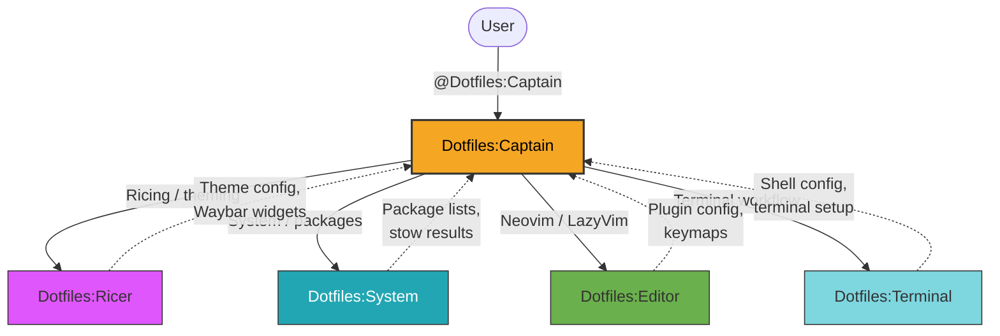

# Dotfiles Agent Team

> System configuration, desktop environment, and ricing management team.

**Last updated:** 2026-03-31

---

## 1. Team Overview

**Dotfiles** is a global Copilot agent team that owns **personal workstation configuration** — Arch Linux system management, Hyprland desktop environment, terminal setup, Neovim editor, and aesthetic ricing. It lives in the dotfiles repo and is available across all workspaces.

### Naming Convention

All agents use the `Team:Role` convention:

| Agent | Role |
|-------|------|
| **Dotfiles:Captain** | Team lead — triages, delegates, verifies |
| **Dotfiles:Ricer** | Hyprland, Waybar, theming, animations |
| **Dotfiles:System** | Arch Linux, packages, security, stow |
| **Dotfiles:Editor** | Neovim mentor, LazyVim configuration |
| **Dotfiles:Terminal** | ZSH, Kitty, Tmux, Starship |

### Scope

- **Owns:** Hyprland config, Waybar, Kitty, ZSH/zinit, Tmux, Neovim/LazyVim, Starship, Catppuccin theming, package management, stow deployment, shell scripts
- **Does NOT own:** Application code (DevOps team), agent creation (Genesis team), MCP servers (MCP team)

---

## 2. Team Roster

| Agent | Role | Description | User-Invocable |
|-------|------|-------------|:--------------:|
| **Dotfiles:Captain** | Captain | Team lead for system, dotfiles, desktop, and ricing | Yes |
| **Dotfiles:Ricer** | Ricer | Hyprland, Waybar, theming, and ricing specialist | No |
| **Dotfiles:System** | System | Arch Linux, packages, security, and dotfiles infrastructure | No |
| **Dotfiles:Editor** | Editor | Neovim mentor and LazyVim configuration specialist | No |
| **Dotfiles:Terminal** | Terminal | ZSH, Kitty, Tmux, and Starship workflow specialist | No |

**Entry point:** All interactions go through `@Dotfiles:Captain`.

---

## 3. Architecture Diagram



---

## 4. Delegation Flow

Captain is an **orchestrator, not an implementer**. Delegates all config changes to specialists.

### Routing Logic

```
User request arrives at Dotfiles:Captain
  │
  ├── Hyprland / Waybar / theming?    → Ricer
  ├── Arch / packages / stow?         → System
  ├── Neovim / LazyVim / plugins?     → Editor
  ├── ZSH / Kitty / Tmux / Starship?  → Terminal
  └── Cross-domain request?           → Sequential delegation
```

---

## 5. Skills Referenced

| Skill | Used By |
|-------|---------|
| `arch-system` | System |
| `catppuccin-theming` | Ricer, all |
| `gaming-linux` | System, Ricer |
| `hyprland-config` | Ricer |
| `kitty-terminal` | Terminal |
| `linux-ricing` | Ricer |
| `neovim-lazyvim` | Editor |
| `secrets-management` | System |
| `shell-scripting` | Terminal, System |
| `stow-patterns` | System |
| `tmux-workflow` | Terminal |
| `waybar-widgets` | Ricer |
| `wayland-ecosystem` | Ricer |
| `zsh-zinit` | Terminal |

---

## 6. File Locations

| Artifact | Path |
|----------|------|
| Agent files | `home/.copilot/agents/dotfiles-*.agent.md` |
| Config files | `config/` (stowed to `~/.config/`) |
| Scripts | `scripts/.local/bin/` |
| This doc | `home/.copilot/agents/DOTFILES-TEAM.md` |
| Deploy target | `~/.copilot/agents/` (via GNU Stow) |
