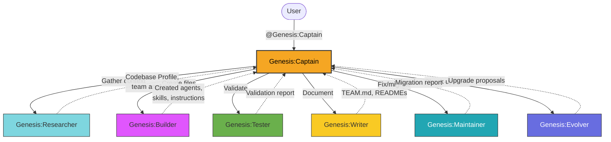

# Genesis Agent Team

> Meta-team that designs, creates, validates, and maintains all agent teams.

**Last updated:** 2026-03-31

---

## 1. Team Overview

**Genesis** is a meta-team — it creates and maintains all other agent teams, including itself. It owns the full lifecycle of Copilot customization: agent design, file creation, testing, documentation, maintenance, and self-improvement.

### Naming Convention

All agents use the `Team:Role` convention:

| Agent | Role |
|-------|------|
| **Genesis:Captain** | Orchestrator — designs teams, delegates, quality oversight |
| **Genesis:Researcher** | Context gatherer, codebase analyzer |
| **Genesis:Builder** | Creates agent, skill, and instruction files |
| **Genesis:Tester** | Validates YAML, tools, handoffs, edge cases |
| **Genesis:Writer** | Team documentation and architecture guides |
| **Genesis:Maintainer** | Batch updates, migrations, fixing broken agents |
| **Genesis:Evolver** | Self-improvement — researches Copilot updates |

### Scope

- **Owns:** Agent creation, skill design, instruction files, team architecture, YAML validation, agent maintenance
- **Does NOT own:** Application code (DevOps team), system config (Dotfiles team), MCP server implementation (MCP team)

---

## 2. Team Roster

| Agent | Role | Description | User-Invocable |
|-------|------|-------------|:--------------:|
| **Genesis:Captain** | Captain | Designs agent teams and orchestrates workforce creation | Yes |
| **Genesis:Researcher** | Researcher | Analyzes codebases and gathers context for team generation | No |
| **Genesis:Builder** | Builder | Creates agent, skill, and instruction files | No |
| **Genesis:Tester** | Tester | Validates agents for YAML correctness, tool names, handoff integrity | No |
| **Genesis:Writer** | Writer | Generates documentation for teams and workflows | No |
| **Genesis:Maintainer** | Maintainer | Applies batch migrations and fixes broken agents | No |
| **Genesis:Evolver** | Evolver | Researches Copilot updates and proposes upgrades | No |

**Entry point:** All interactions go through `@Genesis:Captain`.

---

## 3. Architecture Diagram



---

## 4. Delegation Flow

Captain is an **orchestrator, not an implementer**. Never creates or edits files directly.

### Routing Logic

```
User request arrives at Genesis:Captain
  │
  ├── New agent team?            → Researcher → Design → Builder → Tester → Writer
  ├── Single agent?              → Builder → Tester
  ├── Fix broken agents?         → Maintainer
  ├── Analyze codebase?          → Researcher
  ├── Check for updates?         → Evolver
  ├── Document team?             → Writer
  └── Validate agents?           → Tester
```

### Checkpoint Protocol

| Phase | Steps | Gate |
|-------|-------|------|
| **CP1: Plan** | Understand → Research → Design → Present plan | User approval via `askQuestions` |
| **CP2: Implement & Test** | Builder creates → Tester validates → Report | All validations pass |
| **CP3: Review** | Compare deliverables to plan → Quality check | No critical findings |
| **CP4: Document** | Writer generates docs → Deploy via `make install` | Final summary delivered |

---

## 5. Skills Referenced

| Skill | Purpose |
|-------|---------|
| `agent-design-patterns` | Templates, anti-patterns, quality checklists |
| `codebase-analysis` | Codebase Profile format for team generation |
| `copilot-self-updater` | Fetching latest Copilot patterns |
| `copilot-tools-reference` | Correct tool names (flat format) |
| `copilot-yaml-reference` | YAML frontmatter spec |
| `team-design-framework` | 5-phase team design methodology |
| `agent-team-protocol` | MCP agent communication patterns |

---

## 6. File Locations

| Artifact | Path |
|----------|------|
| Agent files | `home/.copilot/agents/genesis-*.agent.md` |
| Skills | `home/.copilot/skills/*/SKILL.md` |
| This doc | `home/.copilot/agents/GENESIS-TEAM.md` |
| Deploy target | `~/.copilot/agents/` (via GNU Stow) |
