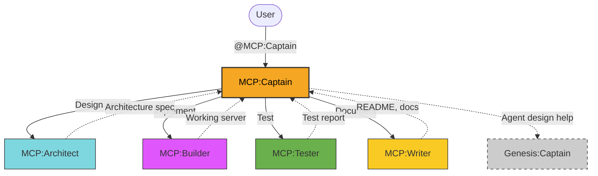
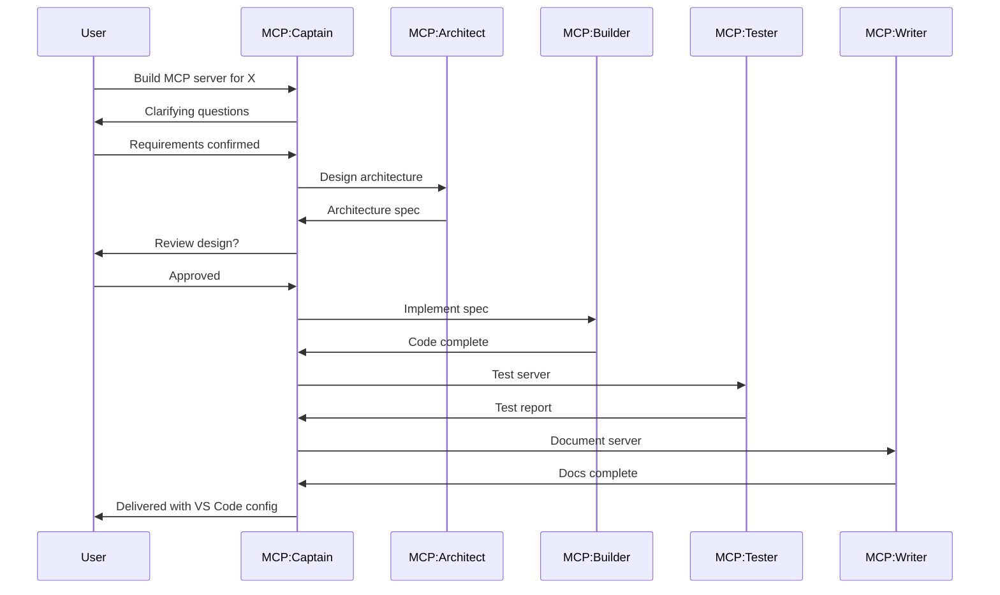

# MCP Agent Team

> MCP server design, implementation, testing, and documentation team.

**Last updated:** 2026-03-31

---

## 1. Team Overview

**MCP** is a global Copilot agent team that owns the **Model Context Protocol server lifecycle** — from architecture design through implementation, testing, and documentation. All servers are built in Python using the FastMCP framework.

### Naming Convention

All agents use the `Team:Role` convention:

| Agent | Role |
|-------|------|
| **MCP:Captain** | Orchestrator — scopes, delegates, reviews |
| **MCP:Architect** | Server architecture and tool design |
| **MCP:Builder** | Python FastMCP implementation |
| **MCP:Tester** | Functional and security testing |
| **MCP:Writer** | Documentation and integration guides |

### Scope

- **Owns:** MCP server architecture, Python FastMCP code, tool definitions, resource patterns, server testing, VS Code MCP configuration
- **Does NOT own:** Application code (DevOps team), system config (Dotfiles team), agent creation (Genesis team)

---

## 2. Team Roster

| Agent | Role | Description | User-Invocable |
|-------|------|-------------|:--------------:|
| **MCP:Captain** | Captain | Leads MCP server design and implementation | Yes |
| **MCP:Architect** | Architect | Designs server architecture, tool definitions, resource patterns | No |
| **MCP:Builder** | Builder | Implements MCP servers in Python using FastMCP | No |
| **MCP:Tester** | Tester | Tests servers for functionality, error handling, edge cases | No |
| **MCP:Writer** | Writer | Generates documentation for servers, tools, and integration | No |

**Entry point:** All interactions go through `@MCP:Captain`.

---

## 3. Architecture Diagram



---

## 4. Delegation Flow

Captain is an **orchestrator, not an implementer**. Delegates all work to specialists.

### Routing Logic

```
User request arrives at MCP:Captain
  │
  ├── New MCP server?       → Architect → Builder → Tester → Writer
  ├── Design only?          → Architect
  ├── Implement spec?       → Builder
  ├── Test existing?        → Tester
  ├── Document existing?    → Writer
  ├── Review code?          → Architect (design) + Tester (quality)
  └── Agent design help?    → Handoff to Genesis:Captain
```

### Build Pipeline



---

## 5. Cross-Team Handoffs

| From | To | When |
|------|----|------|
| MCP:Captain | Genesis:Captain | Need help with agent design or customization |

---

## 6. File Locations

| Artifact | Path |
|----------|------|
| Agent files | `home/.copilot/agents/mcp-*.agent.md` |
| This doc | `home/.copilot/agents/MCP-TEAM.md` |
| Deploy target | `~/.copilot/agents/` (via GNU Stow) |
