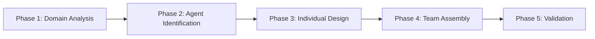
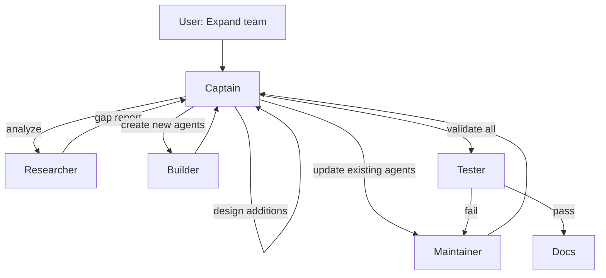
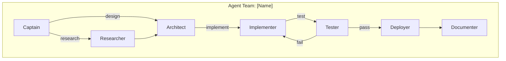

# Team Design Framework

You have expert knowledge of the systematic 5-phase approach for designing complete agent teams.

## Framework Overview



## Phase 1: Domain Analysis

1. **What is the problem domain?** — Software dev? DevOps? Content creation? Industry? Tech stack?
2. **What is the end-to-end workflow?** — Map from initial trigger to final output. Identify decision points and branches.
3. **Who are the human stakeholders?** — Developers? Managers? End users? What expertise levels?

## Phase 2: Agent Identification

4. **What roles are needed?** — Identify distinct responsibilities. Each agent = one clear purpose.
5. **What are the handoff points?** — Where does one agent's work end? What triggers the next?
6. **What shared context exists?** — Common knowledge bases, shared instructions, skill dependencies.

## Phase 3: Individual Agent Design

For EACH agent:

7. **Identity** — Name, persona, expertise level, tone
8. **Primary Tasks** (max 3-5) — Core responsibilities with success criteria
9. **Tool Requirements** — Consult `copilot-tools-reference` skill for correct tool names per archetype
10. **Boundaries** — What this agent does NOT do, who to redirect to

## Phase 4: Team Assembly

11. **Subagent Configuration**
    - Captains: `agents: ["*"]` for full autonomy
    - Specialists: `agents: []` (leaf agents)
    - Hide specialists: `user-invokable: false`

12. **Handoff Configuration**
    - `send: false` for user-review transitions
    - `send: true` for auto-proceed steps
    - Pre-filled prompts for context passing

13. **Delegation Strategy**

    | Feature | `agents: ["*"]` + `runSubagent` | `handoffs:` buttons |
    |---------|-------------------------------|---------------------|
    | Trigger | Agent decides automatically | User clicks button |
    | User Control | None (autonomous) | Full (explicit choice) |
    | Best For | Subtask delegation | Stage transitions |

14. **Shared Resources** — Common instructions files, shared skills, reference documentation

## Phase 5: Validation

15. **Test the team** — Use genesis-tester or manual review:
    - Handoff chain complete (no gaps)?
    - No overlapping responsibilities?
    - No orphan agents (unreachable)?
    - No circular dependencies without exit?
    - Entry point clear?
    - All tool names correct (flat format)?

---

## Phase 6: Team Expansion

Use this phase when expanding an existing team rather than creating from scratch.

### 6.1 Research Existing State

Before adding agents, analyze the current team:

1. **List all team agents** — Find files by prefix (e.g., `genesis-*.agent.md`)
2. **Map current handoffs** — Build graph of who delegates to whom
3. **Identify gaps** — Missing roles, broken handoffs, orphan agents
4. **Check health** — YAML errors, outdated patterns, anti-patterns

**Delegate to:** Genesis Researcher

### 6.2 Design Additions

Design new agents that integrate with existing structure:

1. **Define new role(s)** — What gap does each fill?
2. **Determine placement** — Where in handoff chain? Before/after which agent?
3. **Plan handoff updates** — Which existing agents need new handoffs to/from new agent?
4. **Avoid duplication** — Ensure new agent doesn't overlap with existing roles

### 6.3 Create New Agents

Create agent files for new roles:

**Delegate to:** Genesis:Builder

**Checklist for each new agent:**
- [ ] References updated team table (includes all agents)
- [ ] Has correct handoffs to existing teammates
- [ ] Uses flat tool names
- [ ] Has `agent` tool if needs delegation
- [ ] Follows naming convention (`{team}-{role}.agent.md`)

### 6.4 Update Existing Agents

Modify existing agents to integrate new teammates:

**Delegate to:** Genesis Maintainer

**Updates needed:**
- [ ] Team lead (captain/orchestrator) — add handoffs to new agents
- [ ] Team tables in all agents — add new rows for new agents
- [ ] Handoff chains — connect new agents into workflow
- [ ] Skills references — if new agent requires new skills

### 6.5 Validate Expansion

Verify the expanded team is healthy:

**Delegate to:** Genesis Tester

**Validation checks:**
- [ ] All YAML frontmatter valid (`problems` tool)
- [ ] All handoffs use display names (not filenames)
- [ ] Team tables consistent across all agents
- [ ] No orphan agents (all reachable from entry point)
- [ ] New agents follow established patterns

### Expansion Workflow Diagram



---

## Implementation Team Generation

### From Codebase Analysis to Team

1. **Analyze** — Genesis Researcher analyzes target codebase (using `codebase-analysis` skill)
2. **Profile** — Researcher produces Codebase Profile: structure, architecture, dependencies, devops, testing, documentation
3. **Suggest** — Genesis suggests team structure based on profile
4. **Confirm** — User confirms or modifies suggestion
5. **Generate** — Genesis:Builder creates agent files

### Naming Convention

`{project}-{layer}-{role}.agent.md`

Examples: `myapp-backend-captain`, `webapp-api-tester`, `dashboard-frontend-implementer`

### Team Size Guidelines

| Codebase Complexity | Team Size | Recommended Roles |
|--------------------|-----------|-------------------|
| Simple (1 service) | 3-4 | captain, implementer, tester |
| Medium (2-5 services) | 5-6 | + researcher, architect |
| Complex (monorepo/microservices) | 6-7 | + deployer, documenter |

### Layer-Based Team Splitting

When codebase has distinct layers, create separate teams:

```
project-backend-*     # API/server layer
project-frontend-*    # UI layer
project-infra-*       # Infrastructure layer
```

Each layer team gets its own captain and specialists.

### Standard Implementation Roles

| Role | Purpose | Delegates To |
|------|---------|-------------|
| **captain** | Coordinates layer work | All specialists |
| **researcher** | Fetches Jira stories, gathers context | — |
| **architect** | Designs approach before implementation | — |
| **implementer** | Writes code changes | — |
| **tester** | Validates with tests | — |
| **deployer** | Creates PRs, manages CI/CD | — |
| **documenter** | Updates docs, Confluence | — |

## Team Visualization Template



## Agent Templates

Consult the `agent-design-patterns` skill for complete templates for each role archetype.
